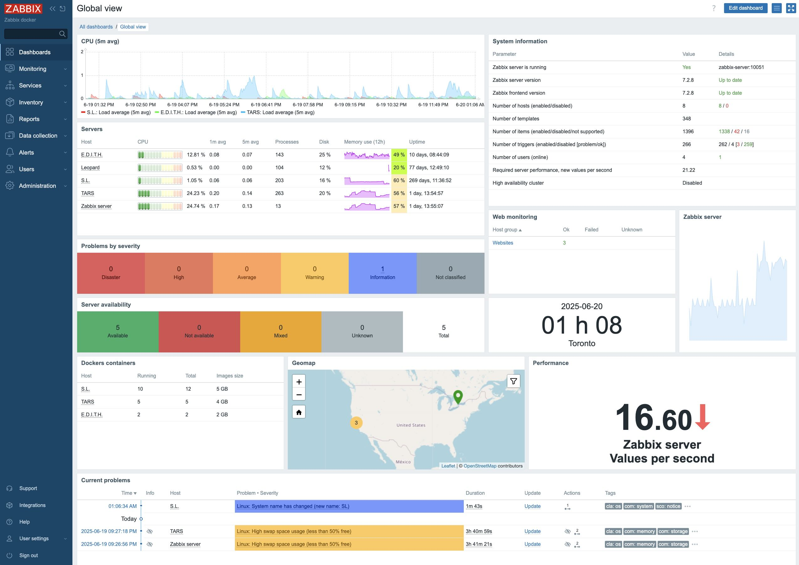

import DocCardList from '@theme/DocCardList';

# Zabbix

[www.zabbix.com](https://www.zabbix.com/)



## Docs

<DocCardList />

## Core structure

| Component            | Role/Description                                                                            |
| -------------------- | ------------------------------------------------------------------------------------------- |
| **Zabbix Server**    | Central core—processes data, manages configuration, sends notifications, stores data in DB  |
| **Zabbix Agents**    | Installed on monitored hosts (Linux/Windows); collect metrics and send to server/proxy      |
| **Zabbix Proxy**     | Optional; collects data from remote networks, sends to server (good for distributed setups) |
| **Zabbix Database**  | Stores configuration, events, and historical data (MySQL, PostgreSQL, etc.)                 |
| **Zabbix Web UI**    | Web interface for monitoring status, viewing data, configuring items, alerts                |
| **Zabbix Frontend**  | The PHP application that provides the web UI                                                |
| **Media Types**      | Mechanisms for notifications (Email, SMS, scripts, etc.)                                    |
| **Items & Triggers** | Items are what’s monitored; triggers define problem conditions                              |
| **Templates**        | Reusable monitoring settings (items, triggers, graphs, etc.) for hosts                      |

## Monitoring Architecture Diagram

```txt
                        ┌─────────────────────────┐
                        │      Zabbix Admin       │
                        │   (Web Interface User)  │
                        └───────────┬─────────────┘
                                    │
                             (Web Browser)
                                    │
                        ┌───────────▼─────────────┐
                        │     Zabbix Frontend     │
                        │     (Web Interface)     │
                        └───────────┬─────────────┘
                                    │
                        ┌───────────▼─────────────┐
                        │     Zabbix Server       │
                        │  (Core Monitoring App)  │
                        └───┬────────────┬────────┘
             (Direct DB)   │             │    (Proxies)
                        ┌──▼───┐     ┌───▼────────────┐
                        │Database│    │ Zabbix Proxy  │
                        │ (MySQL │    │ (Optional,    │
                        │Postgres│    │ for remote or │
                        │ etc.)  │    │ distributed)  │
                        └───┬────┘    └───┬───────────┘
                            │             │
                            │             │
            ┌───────────────┼─────────────┴────────────────────┐
            │               │                                  │
    ┌───────▼───────┐┌──────▼────────┐               ┌─────────▼──────────┐
    │Linux Host     ││Windows Host   │   ...         │Network Devices     │
    │(Zabbix Agent) ││(Zabbix Agent) │               │(SNMP, IPMI, etc.)  │
    └───────────────┘└───────────────┘               └────────────────────┘
            │                │                               │
       (Agent Reports)  (Agent Reports)                 (SNMP/IPMI)
```

