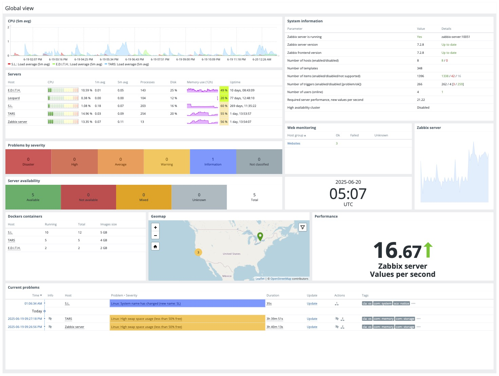

# Generate Zabbix PDF Reports



## Prerequisites

### Component requirements

- **zabbix-web-service** is required
  - 👆 see `docker-compose.yml` file: **With Web Service**

### Configuration requirements

- **zabbix-server** is configured with env for web service
  - 👆 see `docker-compose.yml` file: [**With Web Service config**](./install-dc.mdx#define-docker-compose)
- **Frontend URL** is set, I'm using containers, so `http://zabbix-web:8080/`
  - may need to restart **zabbix-web** after configure if seeing *Frontend URL not set* error
- At least one **Media** Alert is enabled
- At least one **user** is configured with media alert

### Debugging

Check the logs and ask AI chatbots for help.

```bash
docker logs zabbix-web-service
docker exec -it zabbix-server env | grep ZBX
docker logs zabbix-server | grep -i web
docker logs zabbix-server | grep report
```

## Create a Report

### Create from Dashboard

Choose a dashboard and in the action menu: **Create new report**
